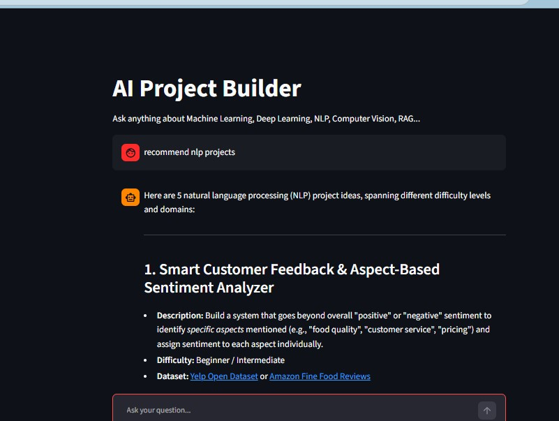

# AI-Research-Assistant
 

AI Research Assistant using RAG, LangGraph, ChromaDB, and Gemini/OpenRouter for answering questions from AI research papers.


# AI Research Assistant

An AI-powered Research Assistant that answers questions about Artificial Intelligence using Retrieval-Augmented Generation (RAG).

The system retrieves relevant information from a curated knowledge base of AI research papers before generating responses, making the answers more accurate and grounded.

---

## Features

- Retrieval-Augmented Generation (RAG)
- ChromaDB Vector Database
- LangGraph Agent
- LangChain
- Google Gemini API
- OpenRouter Support (Automatic Fallback)
- HuggingFace Embeddings
- Streamlit User Interface
- PDF Knowledge Base

---

## Knowledge Base

The assistant is built on a collection of research papers covering topics such as:

- Machine Learning
- Deep Learning
- Computer Vision
- Natural Language Processing
- Transformers
- BERT
- RoBERTa
- CNN
- YOLO
- Attention Mechanism
- RAG
- Large Language Models

---

## Project Structure

```
AI_Research_Assistant/
│
├── app.py
├── requirements.txt
├── .env.example
│
├── knowledge_base/
│   └── PDF papers
│
├── vector_db/
│   └── Chroma Database
│
├── src/
│   ├── agent.py
│   ├── llm.py
│   ├── prompts.py
│   ├── rag.py
│   ├── retriever.py
│   └── tools.py
│
└── test_*.py
```

---

## Technologies

- Python
- LangChain
- LangGraph
- ChromaDB
- HuggingFace Embeddings
- Sentence Transformers
- Streamlit
- Google Gemini API
- OpenRouter API
- python-dotenv

---


## Example Questions

- Explain BERT.
- What is Retrieval-Augmented Generation?
- Compare BERT and RoBERTa.
- Explain the Transformer architecture.
- How does YOLO work?
- What is Self-Attention?
- Recommend models for sentiment analysis.
- Generate NLP project ideas.


## License

This project is intended for educational and learning purposes.
